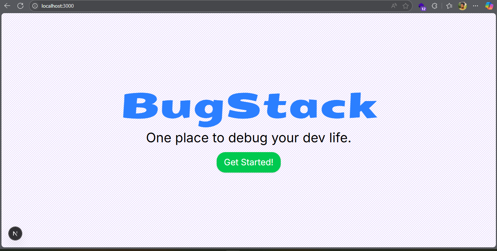
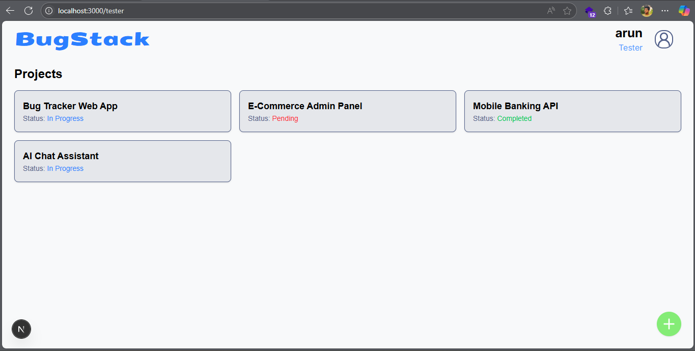
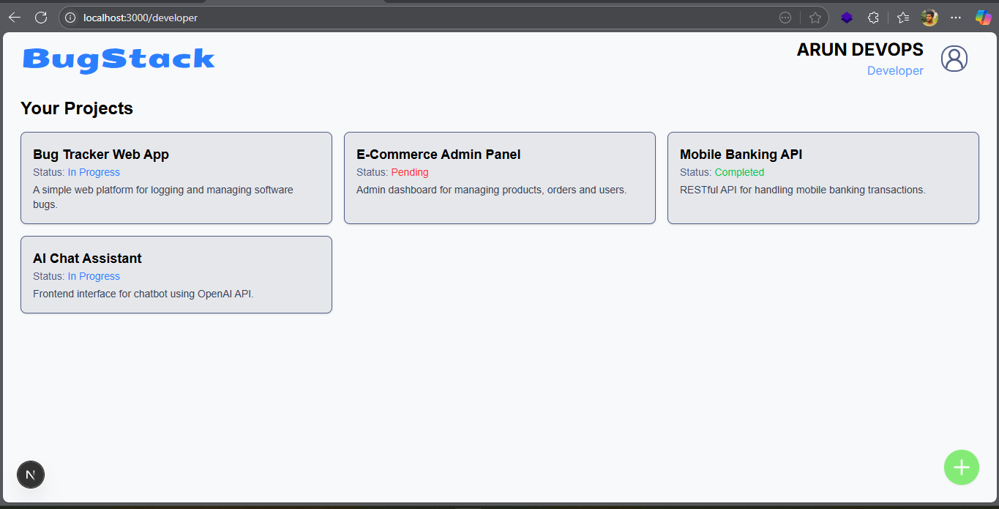
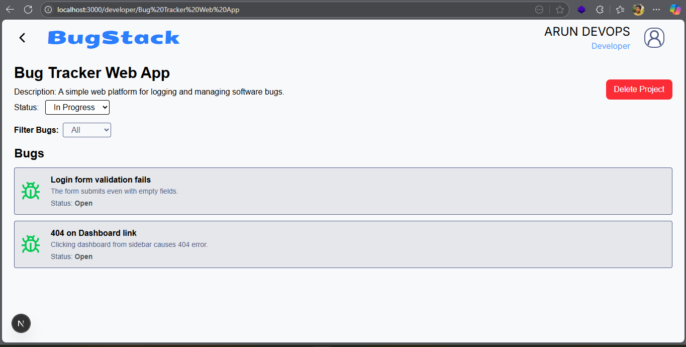
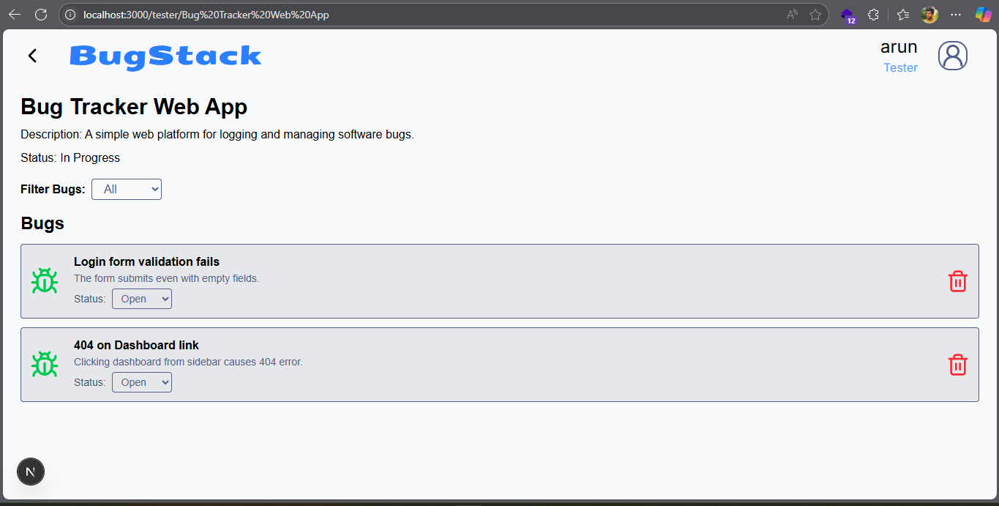

# 🐛 BugStack - Bug Tracking System

BugStack is a modern web-based bug tracking system designed for **developers** and **testers** to manage software issues effectively. It supports role-based functionality, real-time bug reporting, project management, and streamlined collaboration between developers and testers.

---

## 🚀 Features

### 👩‍💻 Developer Dashboard
- Create and manage projects
- View bugs reported under assigned projects
- Update project status
- Delete projects if needed

### 🧪 Tester Dashboard
- Report bugs with name, description, and related project
- View all bugs reported
- Update bug status (open/closed)

### 🌟 Shared Features
- Authenticated routing via localStorage
- Project-filtered bug listings
- Bug filtering by status
- Visual loading skeletons
- Fully responsive UI with consistent theme

---

## 🛠️ Tech Stack

| Tech         | Description                      |
|--------------|----------------------------------|
| **Next.js**  | React framework with routing     |
| **MongoDB**  | NoSQL database for persistence   |
| **Mongoose** | ODM for MongoDB                  |
| **Tailwind** | Utility-first CSS framework      |
| **Lucide**   | Icons for a clean UI             |

---


## 📦 Setup Instructions

1. **Clone the repo**
   ```bash
   git clone https://github.com/Arun-Arunagiri/bugstack.git
   cd bugstack
2. Install dependencies

npm install

3. Configure Environment
Create a .env.local file with your MongoDB URI:

MONGODB_URI=mongodb+srv://<username>:<password>@cluster.mongodb.net/bugstack

4. Run the development server

npm run dev
5. Visit the app

Open http://localhost:3000 in your browser.

🧪 Sample Test Users
Role	Email	Password
Developer	dev1@example.com	123456
Tester	tester1@example.com	123456

📸 Screenshots

### Landing Page


### 🧪 Tester Dashboard


### 👨‍💻 Developer Dashboard


### 📊 Project Details Page




🙌 Contributing
Contributions are welcome! Please open an issue or submit a pull request if you find bugs or have feature suggestions.

📄 License
This project is licensed under the MIT License.

✨ Acknowledgements
Thanks to the open-source community and icon libraries like Lucide Icons.


---

Let me know if you'd like a version tailored for deployment instructions (like Vercel) or want to include sample API docs.
